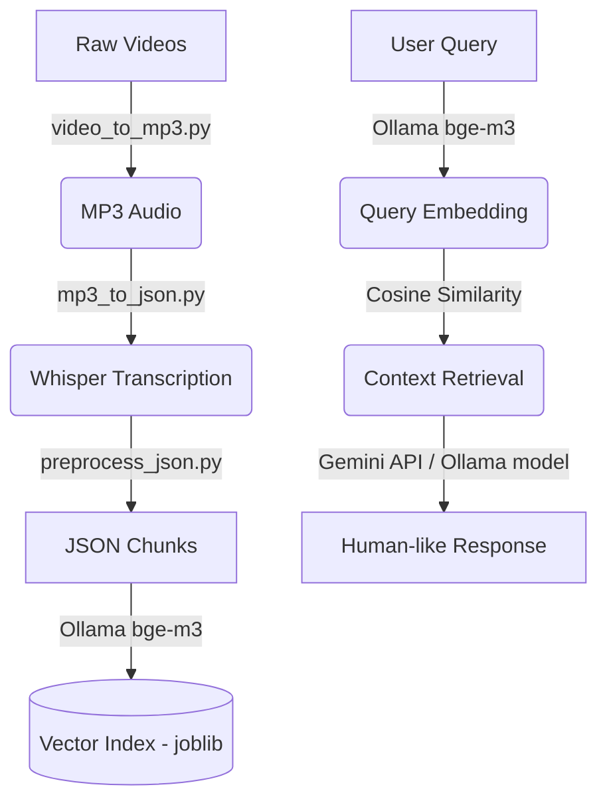

# 🎓 AI Teaching Assistant (RAG-Based)

[](https://www.python.org/)
[](https://ollama.com/)
[](https://ai.google.dev/)
[](https://github.com/openai/whisper)

An intelligent, **Retrieval-Augmented Generation (RAG)** powered teaching assistant designed to answer questions based on your specific video course content. It transcribes video lectures, indexes them into a vector database, and uses a state-of-the-art LLM to provide context-aware answers with specific timestamps.

---

## 🚀 Key Features

- 🎙️ **Video Transcription**: Automatically converts video content to text using OpenAI's Whisper (with support for translation and multilingual audio).
- 🧠 **Context-Aware Q&A**: Employs RAG to ensure answers are strictly grounded in your provided course material.
- 🕒 **Timestamp References**: Guides users to the exact video and timestamp where the concept is discussed.
- 🏘️ **Flexible LLM Integration**: 
  - **Option 1 (Cloud)**: Use **Google Gemini API** for high-quality, state-of-the-art responses.
  - **Option 2 (Local)**: Use **Ollama** (e.g., `llama3.2`, `deepseek-r1`) for 100% private, local inference.
- 🔍 **Efficient Search**: Utilizes `bge-m3` embeddings (via Ollama) for high-precision semantic retrieval.

---

## 📋 System Architecture



---

## 🛠️ Tech Stack

| Component | Technology |
| :--- | :--- |
| **Language** | Python 3.x |
| **Transcription** | OpenAI Whisper (`small` model) |
| **Embeddings** | Ollama (`bge-m3`) |
| **Generation** | Google Gemini & Ollama (`llama3.2`) |
| **Data Handling** | Pandas, Numpy, Joblib |
| **Similarity** | Scikit-learn (Cosine Similarity) |
| **Media** | FFmpeg |

---

## ⚙️ Setup & Installation

### 1. Prerequisites
- **Python 3.8+**
- **FFmpeg**: Must be installed and added to your system PATH.
- **Ollama**: Download from [ollama.com](https://ollama.com/).
- **Google AI API Key**: Obtain from [Google AI Studio](https://aistudio.google.dev/).

### 2. Model Setup
```bash
ollama pull llama3.2
ollama pull bge-m3
```

### 3. Install Dependencies
```bash
pip install openai-whisper pandas numpy scikit-learn requests joblib google-genai
```

### 4. Configuration
Create a `config.py` file in the root directory:
```python
api_key = "YOUR_GOOGLE_AI_API_KEY"
```

---

## 📂 Project Structure

```text
.
├── audios/               # Extracted MP3 files
├── jsons/                # Transcriptions with timestamps
├── videos/               # Raw video files
├── config.py             # Configuration (API Keys)
├── embeddings.joblib     # Precomputed vector index
├── mp3_to_json.py        # Transcription script
├── preprocess_json.py    # Embedding & Indexing script
├── process_incoming.py   # Main Assistant/Query script
├── video_to_mp3.py       # Audio extraction script
└── Readme.md             # Project documentation
```

---

## 📖 Usage Guide

Follow these steps in sequence to process your course content:

### 1. Extract Audio
Place your videos in the `videos/` folder and run:
```bash
python video_to_mp3.py
```

### 2. Takeaway Transcripts
Convert MP3s to JSON transcripts:
```bash
python mp3_to_json.py
```

### 3. Create Vector Index
Generate embeddings and save to `embeddings.joblib`:
```bash
python preprocess_json.py
```

### 4. Start the Assistant
Query your course content:
```bash
python process_incoming.py
```
---

## ✨ Future Scope
- [ ] **GUI Interface**: Build a web dashboard using Streamlit or React.
- [ ] **Multi-format Support**: Support for PDFs and local text documents.
- [ ] **Advanced Chunking**: Improve retrieval precision with semantic chunking.
- [ ] **Real-time Transcription**: Process live video streams.

---

## 🤝 Contributing
Contributions are welcome! Please feel free to submit a Pull Request.